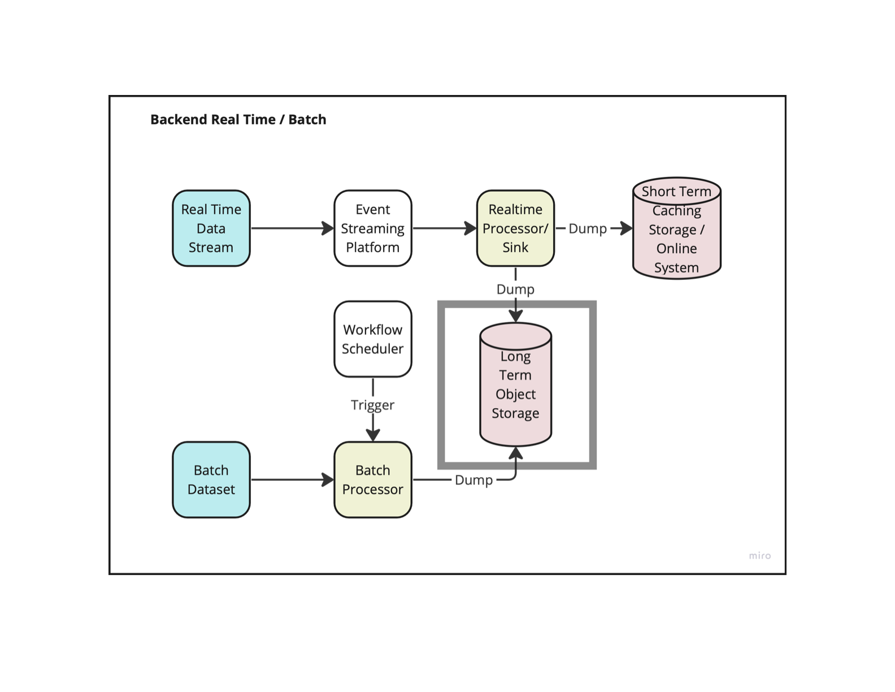

# DEInfraLocal
## Objective
- Build an end to end example for data and machine learning workflow
- Different components can also be used to building local testing infrastructure
    - This is especially important for lot of Data workflows for quick development and testing using local tests and CI/CD
    - This saves overhead cost of spinning up a cluster in infrastructure to test basic implementation

## Components
- We ll divide the infrastructure into 3 components:
    - Backend (backend)
    - Offline Data Processing (offline_infra)
        - Batch
        - Realtime
    - MLOps (ml_ops)

## Architecture Flow

## Tools (TBD)
- Kafka
- Minio (S3 interface)
- Spark (ETL Process)
- Airflow (Workflow Orchestrator)
- Label Studio (Annotator)
- Mlflow / W&B (Model Registry)

## Docker
You ll need a local docker daemon to initiate the different tooling. I am using Docker desktop but there is also Rancher desktop available. 

I faced issues mounting volumes using Rancher daemon and hence reverted to docker desktop
- Info on Rancher Desktop: https://rancherdesktop.io
- Info on Docker Desktop: https://docs.docker.com/desktop/

## Minio
We ll leverage Minio which provides us with api similar to aws s3 and added benefit it provides UI to nivaigate through objects
- Credentials are default: 
    - username: `minioadmin`
    - password: `minioadmin`
- UI access: localhost:9001
    Ref Link: https://min.io
- The `/data` path is mounted to `/datasets` in this repository and that is where you ll see all the data transactions happening when you run the commands
- Data is not being checked in and we ll rather provide commands to download/create the datasets and see the results when as the commands are executed

## PySpark
PySpark is more commonly used for most cases and I personally have been encouraging python over scala.
Scala does have advantages which can be found online given the contributions in spark and better integration for ML libraries we will leverage python for our infrastrusture.

Details on the image being used can be found here: https://jupyter-docker-stacks.readthedocs.io/en/latest/using/specifics.html

- UI access for the spark jupyter labs: http://localhost:8888/
- Sample notebook is checked in under `spark/notebooks`
- Example excuted will create appropriate logs and directory under `spark`

## Running local container
- To spin up the service:
    - docker compose up -d
- To shut down the service
    - docker compose down